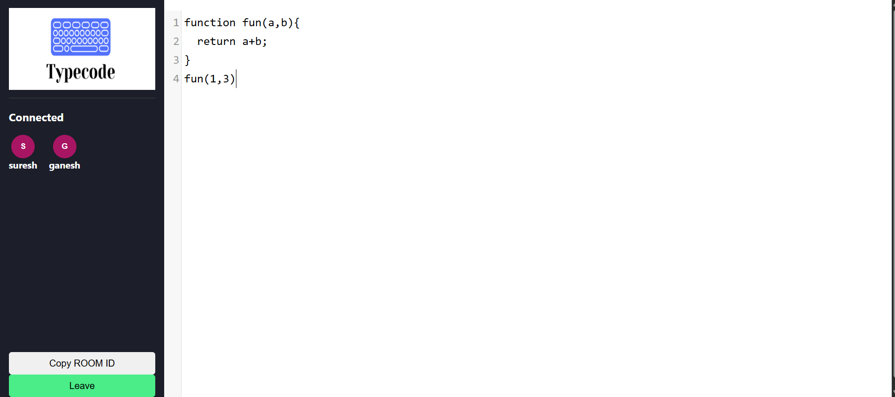

# Collaborative Code Editor



This is a real-time collaborative code editor built with React, Express, Socket.IO, and **Yjs CRDT**. Multiple users can join a room and edit code together, with changes instantly and perfectly synchronized for all participants without any conflicts.

## ✨ Features
- **Real-Time Code Sync**: Powered by Yjs Conflict-Free Replicated Data Types (CRDT).
- **Live Cursors**: See exactly where other people in the room are typing, complete with colored widgets and floating name labels.
- **User Presence Bar**: Instantly see who is currently active in the room.
- **Multiple Users**: Support for multiple users simultaneously editing the exact same document seamlessly.
- **Syntax Highlighting**: Built-in JavaScript syntax highlighting using CodeMirror 5.

## 🛠️ Technology Stack
- **Frontend**: React, React Router, CodeMirror 5, `y-codemirror`
- **Backend**: Node.js, Express, Socket.IO, `y-websocket`
- **Synchronization**: Two separate backends run concurrently:
  - `Express + Socket.IO` (Port `3001`): Handles room connections, leaving/joining events, and client tracking.
  - `y-websocket` Server (Port `1234`): A dedicated WebSocket server responsible for high-performance Yjs code synchronization and cursor awareness.

---

## 🚀 Running Locally

To run this application locally, you need to start both the React frontend and the Node.js backend.

1. **Install dependencies**:
   ```bash
   npm install
   ```
2. **Start the development servers**:
   ```bash
   npm run dev
   ```
   *Note: This command uses `concurrently` to run both the React development server (`npm start` on port 3000) and the Node.js backend (`npm run server` on port 3001 & 1234).*

3. Open your browser and navigate to `http://localhost:3000`.

---

## 🌍 Deployment Guide (Render.com)

Because we have refactored the application to run both Socket.IO and the Yjs `y-websocket` server on the **same single port** (Port 3001), deploying this to platforms like [Render](https://render.com) is incredibly simple.

### Render Web Service Deployment Steps:

**1. Prepare your Repository:**
Make sure all your code is pushed to your GitHub/GitLab repository.

**2. Create a New Web Service:**
- Log in to your Render dashboard.
- Click **New +** and select **Web Service**.
- Connect your GitHub repository.

**3. Configure the Web Service:**
- **Name**: `collaborative-editor` (or whatever you prefer)
- **Environment**: `Node`
- **Build Command**: 
  ```bash
  npm install && npm run build
  ```
  *(This installs dependencies and builds the production-ready React files into the `build/` folder.)*
- **Start Command**:
  ```bash
  npm run server-only
  ```
  *(If you don't have this command, simply use `node server.js`.)*

**4. Add Environment Variables (Optional but recommended):**
Under the "Environment" tab, add:
- `CLIENT_ORIGIN`: Your Render app's URL (e.g., `https://your-app-name.onrender.com`).

**5. Deploy!**
Click "Create Web Service". Render will automatically build the React app, spin up the Node.js server, and handle all the routing (including WebSockets for both Socket.IO and Yjs) flawlessly over HTTPS!
